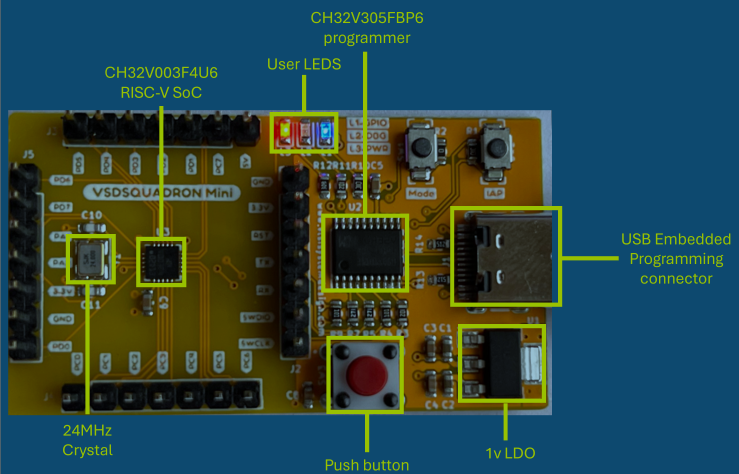
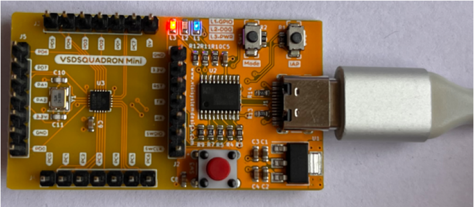
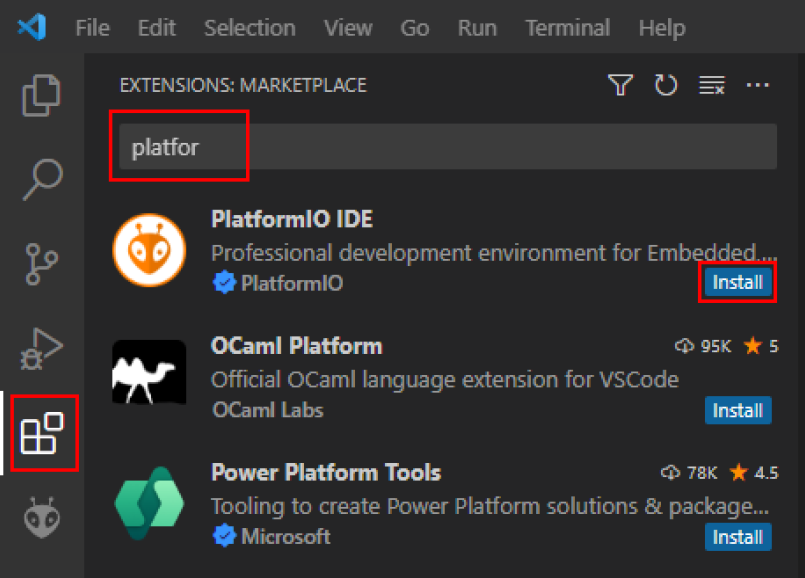
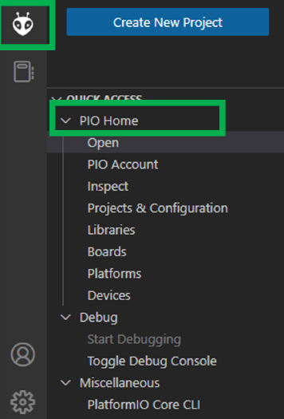
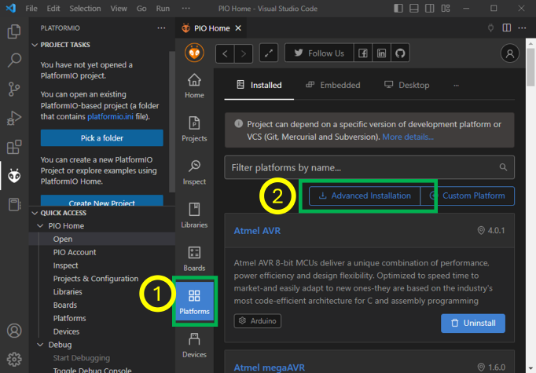
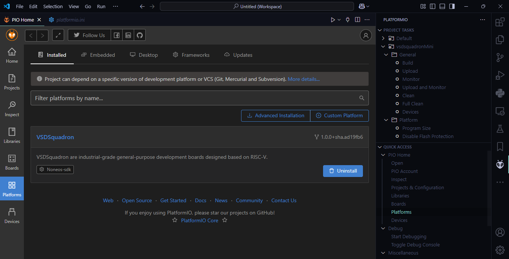

# SAMSUNG RISC-V Workshop
#### The RISC-V Workshop, certified by Samsung and VLSI System Design under the guidance of Kunal Ghosh, is a specialized training program designed to provide hands-on experience in System-on-Chip (SoC) design and embedded systems development using the RISC-V-based VSD Squadron Mini board, culminating in an industry-recognized certification.

## Basic Details
   <b>Name : </b>Charan Mahendaran
   
   <b>Email ID : </b>charanmahendaran@gmail.com
   
   <b>College : </b>The Global Academy Of Technology
   
   <b>GitHub Profile : </b>[charanmahendaran](https://github.com/charanmahendaran)
   
   <b>LinkedIN Profile : </b>[charanmahendaran](https://www.linkedin.com/in/charanmahendaran/)
<hr>


<details>
<summary><b> VSDSquadron Mini RISC-V Development Board </b></summary> 
   
### 1. Overview
<p align="centre"> 

* #### Core Processor:
    * Features the CH32V003F4U6 RISC-V chip with ```RV32EC``` instruction set.
    * Supports ```24MHz``` main clock frequency and two-level interrupt nesting.
    * High-speed memory: ```2KB SRAM```, ```16KB``` CodeFlash, and ```1920B``` for bootloader.
* #### Key Features:
    * Integrated clock system with 24MHz and 128kHz RC oscillators.
    * 15 GPIO ports, enabling extensive peripheral connections.
    * Communication interfaces: ```USART```, ```I2C```, ```SPI```.
    * Onboard programming using the ```CH32V305FBP6``` protocol.
    * Powered via USB-C connector.

### 2. Specifications

* #### Form Factor: 
    * 50 x 28 mm with a maximum height of 8mm (top) and 1mm (bottom).
  
<p align="centre"> 
   
* #### Power:
   * Nominal Input: 5V.
   * I/O Voltage: 3.3V.
   * Source/Sink Current: 8mA per I/O pin.

* #### Connectivity:
   * Digital I/O Pins: 15.
   * Analog I/O Pins: 10-bit ADC.
   * PWM Pins: 14.
   * External interrupts: 8.
* #### Other Features:
   * Built-in LED (PD6).
   * Programmer/debugger included, no external adapter required.

### 3. Kit Contents
* 1x VSDSquadron Mini Board.
* USB 2.0 Type-C connector.

### 4. Installation & Setup
To program and test the board (e.g., a "blink" example):
* #### Software:
   * Install ```VSCode``` and the ```PlatformIO``` extension.
   * Set up the ```CH32V``` platform via the repository URL provided.
   * Install the ```WCH-Link``` driver for programming.
   * USing ```Oracle Virtual Box``` to execute virtually.
* #### Steps:
   * Connect the board via USB-C.
   * Use ```PlatformIO``` in VSCode to ```build``` and ```upload``` the code.
   * Follow provided visuals and step-by-step instructions in the datasheet.
 
   <p float="centre">
       
       
       
       
       
   </p>  

* #### Completion
   *   After completing the installation, verify its accuracy by ensuring the following window appears as expected.

<p align="centre"> 
<p align="centre"> 

### 5. Handling and Usage
   * ESD Precautions: Handle with care to avoid static damage.
   * Operating Temperature: Designed for room temperature, ```20-35°C```.
   * Powering Up: Use ```USB-C``` connection for power and programming.
</details>

<hr>

<details>
   <summary><b> Lab Session 1 : </b>Understood the basics of RISC-V and Openlane</summary>
   
<p align="centre"> 
</details>

<hr>

<details>
   <summary><b> Task 1 : </b>Install the RISC-V toolchain using the provided VDI link by setting up a Virtual Machine in Oracle VM VirtualBox. Convert C programs to RISC-V architecture seamlessly within this environment</summary>
   
- Installing leafpad editor using the command - ```sudo snap install leafpad``` or ```sudo apt install leafpad```

### Installing RISC-V and Setting up VM in Oracle VM Box:
<p align="left"> 

### Creating a Simple Program for finding sum of n numbers:
<p float="left">
      
      
</p>

- Creating a Simple program in leafpad editor using the command - ```leafpad sum1ton.c &```
- Compiling the program using the command - ```gcc sum1ton.c```
### Main function in RISCV64 Architecture:
<p align="left"> 
   
- Compiling in RISCV Architecture using command - ```riscv64-unknown-elf-gcc -O1 -mabi=lp64 -march=rv64i -o mul1ton.o mul1ton.c ```

### Running program in O1 Option in RISCV64:
<p float="left">
   
   
</p>

- Opening in RISCV using Object Dump in O1 Option - ```riscv64-unknown-elf-objdump -d mul1ton.o | less ```
</details>

<hr>

<details>
   <summary><b> Task 2 : </b>Observe performance differences in the SPIKE simulation under -O1 and -Ofast compiler optimization flags by compiling a basic C program using RISC-V GCC and collecting object dumps.</summary>

### Simple C Program to find product of n numbers:
<p align="left"> 

### Main function in -O1 Option in RISCV64:
<p align="left"> 
   
### Debugging -O1 in SPIKE:
<p align="left"> 

### Main function in -Ofast Option in RISCV64:
<p align="left"> 

### Debugging -Ofast in SPIKE:
<p align="left"> 
</details>

<hr>

<details>
   <summary><b> Task 3 : </b> Analyze RISC-V software documentation to decode 15 unique instructions from your application code, determine their 32-bit instruction codes and patterns, and classify them by instruction type.</summary>
   
# RISC-V Architecture: A Brief Overview
RISC-V (Reduced Instruction Set Computer - V) is an open-standard instruction set architecture (ISA) that follows the principles of reduced instruction set computing. Unlike proprietary ISAs, RISC-V is free to use without licensing fees, making it a popular choice for academic research, education, and industry applications. This open nature promotes innovation across various sectors, from hardware development to software engineering.

## Why Understanding Instruction Formats Matters
Understanding the structure of RISC-V instruction formats is vital for several reasons:

- Instruction Decoding: Enables accurate execution of instructions.
- Pipeline Design: Optimizes CPU pipeline stages for better performance.
- Compiler Design: Aids in generating efficient machine code.
- Debugging & Verification: Helps identify errors in hardware and software.
- Extensibility: Crucial for adding custom instructions in RISC-V's modular architecture.
- Instruction Types in RISC-V

### RISC-V instructions are categorized into the following types based on their field organization:

#### 1. R-Type (Register-Register):
   - Operations: Arithmetic and logical operations between registers.
   - Example: ADD rd, rs1, rs2 (rd = rs1 + rs2)
      
#### 2. I-Type (Immediate):
   - Operations: Arithmetic operations using a register and an immediate value.
   - Example: ADDI rd, rs1, imm (rd = rs1 + imm)
     
#### 3. S-Type (Store):
   - Operations: Storing data from a register to memory.
   - Example: SW rs1, imm(rs2) (memory[rs2 + imm] = rs1)
     
#### 4. B-Type (Branch):
   - Operations: Conditional branching based on register values.
   - Example: BEQ rs1, rs2, offset (branch if rs1 == rs2)

#### 5. U-Type (Upper Immediate):
   - Operations: Instructions that use large immediate values.
   - Example: LUI rd, imm (load upper immediate into rd)

#### 6. J-Type (Jump):
   - Operations: Unconditional jumps to a specified address.
   - Example: JAL rd, imm (jump and link)

## Key Fields in RISC-V Instructions
Each instruction in RISC-V has several key fields that define its functionality:
- Opcode: Specifies the operation type.
- Function Fields (funct3, funct7): Define the specific operation within an instruction type.
- Immediate Values: Represent constants used in computations.
- Registers: Indicate source and destination registers for data operations.
- Example: LUI (Load Upper Immediate)
- For an instruction like:
   * ```lui x5, 0x12345```
   * Encoding: The immediate value ```0x12345``` is loaded into the upper 20 bits of register ```x5```.
   * Execution: The instruction loads the value into the upper 20 bits of ```x5```, while the lower bits are set to zero.
  
## Instruction Categories
#### Arithmetic Instructions
- ADD: Adds values in two registers.
Example: ADD rd, rs1, rs2 (rd = rs1 + rs2)
- ADDI: Adds a register and an immediate.
Example: ADDI rd, rs1, imm (rd = rs1 + imm)

#### Logical Instructions
- AND: Bitwise AND.
Example: AND rd, rs1, rs2 (rd = rs1 & rs2)
- OR: Bitwise OR.
Example: OR rd, rs1, rs2 (rd = rs1 | rs2)

#### Branch Instructions
- BEQ: Branch if equal.
Example: BEQ rs1, rs2, offset (branch if rs1 == rs2)
- BNE: Branch if not equal.
Example: BNE rs1, rs2, offset (branch if rs1 != rs2)

#### Load and Store Instructions
- LW: Load a word from memory.
Example: LW rd, offset(rs1) (rd = memory[rs1 + offset])
- SW: Store a word to memory.
Example: SW rs1, offset(rs2) (memory[rs2 + offset] = rs1)

#### Special Instructions
- AUIPC: Add upper immediate to PC (Program Counter).
Example: AUIPC rd, imm (rd = PC + imm << 12)


## RISC-V Extensions
RISC-V allows for optional extensions to provide additional functionality:
- M: Integer multiplication and division.
- A: Atomic operations.
- F, D, Q: Floating-point operations (```32-bit```, ```64-bit```, ```128-bit```).
- C: Compressed instructions.
  
## RISC-V Object Dump
<p align="left"> 

### INSTRUCTION 1:
<p align="left"> 

### <b>Instruction 1 : lui a0, 0x21</b>
- Opcode: 0110111 (7 bits)
- Immediate: 0x21 (20 bits)
- Destination Register (rd): a0 (x10, 5 bits)

<b>Breakdown:</b>
- Immediate (0x21): 0000000000100001
- rd (a0 = x10): 01010
- Opcode: 0110111

Machine Code: ```0x02100037```

```
Final 32-bit Instruction Format:
| imm[31:12]       | rd    | opcode  |
| 0000000000100001 | 01010 | 0110111 |
```
Final Binary Representation:
```0000000000100001010100110111011```
____

### INSTRUCTION 2:
<p align="left"> 

### <b>Instruction 2: addi sp, sp, -16</b>
- Opcode: 0010011 (7 bits)
- Function (funct3): 000 (3 bits)
- Immediate: -16 (12 bits, two's complement)
- Source Register (rs1): sp (x2, 5 bits)
- Destination Register (rd): sp (x2, 5 bits)
- Function (funct3): 000 (3 bits)

<b>Breakdown:</b>
- Immediate (-16): 111111110000
- rs1 (sp = x2): 00010
- funct3: 000
- rd (sp = x2): 00010
- Opcode: 0010011

Machine Code: ```0xfff30313```

```
Final 32-bit Instruction Format:
| imm[11:0]      | rs1   | funct3 | rd    | opcode  |
| 111111110000   | 00010 | 000    | 00010 | 0010011 |
```
Final Binary Representation:
```11111111000000010000000110010011```
____

### INSTRUCTION 3:
<p align="left"> 

The RISC-V pseudo-instruction li a2, 120 (load immediate) is translated into a real instruction. Since 120 is a small value that fits within 12 bits, it will use the addi instruction with the x0 (zero) register as the source register. The actual instruction becomes:

### <b>Instruction 3: addi a2, x0, 120</b>
- Opcode: 0010011 (7 bits)
- Immediate: 120 (12 bits, unsigned)
- Source Register (rs1): x0 (zero, 5 bits)
- Destination Register (rd): a2 (x12, 5 bits)
- Function (funct3): 000 (3 bits)

<b>Breakdown:</b>
- Immediate (120): 000001111000
- rs1 (x0): 00000
- funct3: 000
- rd (a2 = x12): 01100
- Opcode: 0010011

Machine Code: ```0x07830313```

```
Final 32-bit Instruction Format:
| imm[11:0]      | rs1   | funct3 | rd    | opcode  |
| 000001111000   | 00000 | 000    | 01100 | 0010011 |
```
Final Binary Representation:
```0000011110000000000001100010011```
____

### INSTRUCTION 4:
<p align="left"> 

The RISC-V pseudo-instruction li a1, 5 (load immediate) is translated into a real instruction. Since 5 is a small value that fits within 12 bits, it will use the addi instruction with the x0 (zero) register as the source register. The actual instruction becomes:

### <b>Instruction 4: addi a1, x0, 5</b>
- Opcode: 0010011 (7 bits)
- Immediate: 5 (12 bits, unsigned)
- Source Register (rs1): x0 (zero, 5 bits)
- Destination Register (rd): a1 (x11, 5 bits)
- Function (funct3): 000 (3 bits)

<b>Breakdown:</b>
- Immediate (5): 000000000101
- rs1 (x0): 00000
- funct3: 000
- rd (a1 = x11): 01011
- Opcode: 0010011

Machine Code: ```0x00030313```

```
Final 32-bit Instruction Format:
| imm[11:0]      | rs1   | funct3 | rd    | opcode  |
| 000000000101   | 00000 | 000    | 01011 | 0010011 |
```
Final Binary Representation:
```00000000010100000000010110010011```
____

### INSTRUCTION 5:
<p align="left"> 

### <b>Instruction 5: addi a0, a0, 384</b>
- Opcode: 0010011 (7 bits)
- Immediate: 384 (12 bits, unsigned)
- Source Register (rs1): a0 (x10, 5 bits)
- Destination Register (rd): a0 (x10, 5 bits)
- Function (funct3): 000 (3 bits)

<b>Breakdown:</b>
- Immediate (384): 000011000000
- rs1 (a0 = x10): 01010
- funct3: 000
- rd (a0 = x10): 01010
- Opcode: 0010011

Machine Code: ```0x18030313```

```
Final 32-bit Instruction Format:
| imm[11:0]      | rs1   | funct3 | rd    | opcode  |
| 000011000000   | 01010 | 000    | 01010 | 0010011 |
```
Final Binary Representation:
```00001100000001010000010100010011```
____

### INSTRUCTION 6:
<p align="left"> 

### <b>Instruction 6: sd ra, 8(sp)</b>
- Opcode: 0100011 (7 bits)
- Immediate: 8 (12 bits, split as imm[11:5] and imm[4:0])
- Source Register (rs2): ra (x1, 5 bits)
- Base Register (rs1): sp (x2, 5 bits)
- Function (funct3): 011 (3 bits)

<b>Breakdown:</b>
- Immediate (8): imm[11:5] = 0000000, imm[4:0] = 01000
- rs2 (ra = x1): 00001
- rs1 (sp = x2): 00010
- funct3: 011
- Opcode: 0100011

Machine Code: ```0x00812123```

```
Final 32-bit Instruction Format:
| imm[11:5] | rs2   | rs1   | funct3 | imm[4:0] | opcode |
| 0000000   | 00001 | 00010 | 011    | 01000    | 0100011 |
```
Final Binary Representation:
```00000000100000010010001000100011```
____

### INSTRUCTION 7:
<p align="left"> 

### <b>Instruction 7: jal ra, 10408</b>
- Opcode: 1101111 (7 bits)
- Immediate: 10408 (20 bits, split for J-type: imm[20], imm[10:1], imm[11], imm[19:12])
- Destination Register (rd): ra (x1, 5 bits)

<b>Breakdown:</b>
- Immediate (10408): imm[20] = 0, imm[10:1] = 0000000000, imm[11] = 1, imm[19:12] = 01010001
- rd (ra = x1): 00001
- Opcode: 1101111

Machine Code: ```0x000520ff```

```
Final 32-bit Instruction Format:
| imm[20] | imm[10:1]     | imm[11] | imm[19:12]   | rd    | opcode  |
| 0       | 0000000000    | 1       | 01010001     | 00001 | 1101111 |
```
Final Binary Representation:
```000000000000000010100001000010111101111```
____

### INSTRUCTION 8:
<p align="left"> 

### <b>Instruction 8: ld ra, 8(sp)</b>
- Opcode: 0000011 (7 bits)
- Immediate: 8 (12 bits, unsigned)
- Source Register (rs1): sp (x2, 5 bits)
- Destination Register (rd): ra (x1, 5 bits)
- Function (funct3): 011 (3 bits)

<b>Breakdown:</b>
- Immediate (8): 000000001000
- rs1 (sp = x2): 00010
- funct3: 011
- rd (ra = x1): 00001
- Opcode: 0000011

Machine Code: ```0x00830303```

```
Final 32-bit Instruction Format:
| imm[11:0]      | rs1   | funct3 | rd    | opcode  |
| 000000001000   | 00010 | 011    | 00001 | 0000011 |
```
Final Binary Representation:
```0000000010000001000000110000011```
____

### INSTRUCTION 9:
<p align="left"> 

### <b>Instruction 9: li a0, 0</b>
- Opcode: 0010011 (7 bits)
- Immediate: 0 (12 bits, unsigned)
- Source Register (rs1): x0 (zero, 5 bits)
- Destination Register (rd): a0 (x10, 5 bits)
- Function (funct3): 000 (3 bits)

<b>Breakdown:</b>
- Immediate (0): 000000000000
- rs1 (x0 = x0): 00000
- funct3: 000
- rd (a0 = x10): 01010
- Opcode: 0010011

Machine Code: ```0x00030313```

```
Final 32-bit Instruction Format:
| imm[11:0]      | rs1   | funct3 | rd    | opcode  |
| 000000000000   | 00000 | 000    | 01010 | 0010011 |
```
Final Binary Representation:
```00000000000000000000010110010011```
____

### INSTRUCTION 10:
<p align="left"> 

### <b>Instruction 10: addi sp, sp, 16</b>
- Opcode: 0010011 (7 bits)
- Immediate: 16 (12 bits, unsigned)
- Source Register (rs1): sp (x2, 5 bits)
- Destination Register (rd): sp (x2, 5 bits)
- Function (funct3): 000 (3 bits)

<b>Breakdown:</b>
- Immediate (16): 000000001000
- rs1 (sp = x2): 00010
- funct3: 000
- rd (sp = x2): 00010
- Opcode: 0010011

Machine Code: ```0x01030313```

```
Final 32-bit Instruction Format:
| imm[11:0]      | rs1   | funct3 | rd    | opcode  |
| 000000001000   | 00010 | 000    | 00010 | 0010011 |
```
Final Binary Representation:
```00000000100000010000000110010011```
____

### INSTRUCTION 11:
<p align="left"> 

### <b>Instruction 11: auipc a5, 0xffff0</b>
- Opcode: 0010111 (7 bits)
- Immediate: 0xffff0 (20 bits)
- Destination Register (rd): a5 (x15, 5 bits)

<b>Breakdown:</b>
- Immediate (0xffff0): 1111111111110000
- rd (a5 = x15): 01111s
- Opcode: 0010111

Machine Code: ```0xfffff073```

```
Final 32-bit Instruction Format:
| imm[31:12]         | rd    | opcode  |
| 1111111111110000   | 01111 | 0010111 |
```
Final Binary Representation:
```11111111111100000111100101110111```
____

### INSTRUCTION 12:
<p align="left"> 

### <b>Instruction 12: bcqz a5, 0x100f4</b>
- Opcode: 1100011 (7 bits for `bcqz`)
- Immediate: 0x100f4 (20 bits, signed offset)
- Source Register (rs1): a5 (x15, 5 bits)
- Function (funct3): 100 (3 bits)

<b>Breakdown:</b>
- Immediate (0x100f4): 0001000000011110100
- rs1 (a5 = x15): 01111
- funct3: 100
- Opcode: 1100011

Machine Code: ```0x100f3133```

```
Final 32-bit Instruction Format:
| imm[12] | imm[10:5]  | rs1   | funct3 | imm[4:1] | imm[11] | opcode  |
| 0       | 0001000000 | 01111 | 100    | 111101   | 0       | 1100011 |
```
Final Binary Representation:
```00010000000111101111001000011011```
____

### INSTRUCTION 13:
<p align="left"> 

### <b>Instruction 13: addi a0, a0, 272 # 101f8 <__libc_fini_array></b>
- Opcode: 0010011 (7 bits)
- Immediate: 272 (12 bits, unsigned)
- Source Register (rs1): a0 (x10, 5 bits)
- Destination Register (rd): a0 (x10, 5 bits)
- Function (funct3): 000 (3 bits)

<b>Breakdown:</b>
- Immediate (272): 000000100010
- rs1 (a0 = x10): 01010
- funct3: 000
- rd (a0 = x10): 01010
- Opcode: 0010011

Machine Code: ```0x00012113```

```
Final 32-bit Instruction Format:
| imm[11:0]      | rs1   | funct3 | rd    | opcode  |
| 000000100010   | 01010 | 000    | 01010 | 0010011 |
```
Final Binary Representation:
```00000010001001010000000110010011```
____

### INSTRUCTION 14:
<p align="left"> 

### <b>Instruction 14: j 101b0 <atexit></b>
- Opcode: 1101111 (7 bits for `jal`)
- Immediate: 0x101b0 (20 bits)
- Destination Register (rd): x0 (5 bits)

<b>Breakdown:</b>
- Immediate (0x101b0): imm[20] = 0, imm[10:1] = 0000000000, imm[11] = 1, imm[19:12] = 00010000
- rd (x0 = x0): 00000
- Opcode: 1101111

Machine Code: ```0x000501ff```

```
Final 32-bit Instruction Format:
| imm[20] | imm[10:1]     | imm[11] | imm[19:12]   | rd    | opcode  |
| 0       | 0000000000    | 1       | 00010000     | 00000 | 1101111 |
```
Final Binary Representation:
```000000000000000010010000000011111101111```
____

### INSTRUCTION 15:
<p align="left"> 

### <b>Instruction 15</b>: lw a0, 0(sp)
- Opcode: 0000011 (7 bits)
- Immediate: 0 (12 bits, unsigned)
- Base Register (rs1): sp (x2, 5 bits)
- Destination Register (rd): a0 (x10, 5 bits)
- Function (funct3): 010 (3 bits)

<b>Breakdown:</b>
- Immediate (0): 000000000000
- rs1 (sp = x2): 00010
- funct3: 010
- rd (a0 = x10): 01010
- Opcode: 0000011

Machine Code: ```0x00030283```

```
Final 32-bit Instruction Format:
| imm[11:0]      | rs1   | funct3 | rd    | opcode  |
| 000000000000   | 00010 | 010    | 01010 | 0000011 |
```
Final Binary Representation:
```00000000000000010000100110000011```

</details>

<hr>

<details>
   <summary><b> Task 4 : </b> Simulate the design using the testbench, verify functional correctness by observing output signals, and save waveform snapshots for executed commands.</summary>
   
   ## Terminal Command:
   <p align="centre"> 
   
   ## Instruction 1:
   <p align="centre"> 

   ## Instruction 2:
   <p align="centre"> 

   ## Instruction 3:
   <p align="centre"> 

   ## Instruction 4:
   <p align="centre"> 

   ## Instruction 5:
   <p align="centre"> 

   ## Instruction 6:
   <p align="centre"> 

   ## Instruction 7:
   <p align="centre"> 

   ## Instruction 8:
   <p align="centre"> 

   ## Instruction 9:
   <p align="centre"> 

   ## Instruction 10:
   <p align="centre"> 
   
</details>

<hr>

<details>
   <summary><b> Task 5 : </b> Documentation of the project.</summary>

   ## COMBINATION LOCK SYSTEM USING VSDSQM BOARD & SOLENOID LOCK
   #### This project implements a combination lock system using the VSDSQM board (CH32V003F4U6), three push buttons, a TIP122 transistor, and a 12V solenoid lock. The system unlocks only when the correct sequence of button presses is entered.

   ## Project Overview :
- Microcontroller: VSDSQM (RISC-V based CH32V003F4U6).
- Input: 3 push buttons (PA1, PA2, PC4).
- Output: TIP122 transistor (switches solenoid lock).
- Actuator: 12V solenoid lock (used for locking/unlocking).
- Power: VSDSQM runs on 5V, solenoid lock runs on 12V.

When the correct sequence of button presses is entered, the microcontroller activates the solenoid lock for 5 seconds using a TIP122 transistor.

## How It Works :
- The system starts in a locked state.
- The user presses the buttons in a specific order.
- If the sequence is correct, the solenoid lock is powered ON, unlocking the door.
- After 5 seconds, the solenoid turns OFF, locking the door again.
- If the wrong sequence is entered, the system resets and the user must start over.

## Components Required :

| Component	| Quantity | Use in the Project |
| --- | --- | --- |
| VSDSQM Board (CH32V003F4U6) |	1 |	Microcontroller to handle input processing and solenoid control. |
| Push Buttons (2-pin) |	3 |	Used for user input to enter the correct unlock sequence. |
| TIP122 Transistor (NPN Darlington) |	1 |	Acts as a switch to control the high-power solenoid lock using a low-power microcontroller signal. |
| 12V Solenoid Lock |	1 |	The locking mechanism that engages/disengages based on the correct sequence. |
| Diode (1N4007 or 1N5819 Schottky) |	1 |	Protects the circuit from voltage spikes when the solenoid turns off. |
| 12V Power Supply (Adapter or Battery Pack) |	1 |	Provides power to the solenoid lock and transistor circuit. |
| Jumper Wires (Male-Male, Male-Female) |	As needed |	Used for making connections between the components and the microcontroller. |
| Breadboard or PCB | 1 |	Helps in assembling and testing the circuit before soldering permanently. |

## System Architecture :
The project consists of the following key components:

<b> 1. Microcontroller: VSDSQM (CH32V003F4U6) </b>
- Acts as the brain of the system.
- Reads button presses and checks if they match the correct sequence.
- Controls the solenoid lock via a TIP122 transistor.

<b> 2. Push Buttons (User Input) </b>
- Three buttons are connected to PA1, PA2, and PC4.
- The buttons use pull-up resistors so that they read HIGH (1) when not pressed and LOW (0) when pressed.
- The sequence logic ensures the lock opens only when the buttons are pressed in the correct order.

<b> 3. TIP122 Transistor (Switching) </b>
- A TIP122 transistor is used to control the solenoid lock.
- The microcontroller works at 3.3V and cannot directly control a 12V solenoid.
- The transistor acts as a switch that turns the solenoid on or off based on the microcontroller’s output.

<b> 4. 12V Solenoid Lock (Actuator) </b>
- When powered, the solenoid unlocks.
- When power is cut off, the solenoid locks again.
- The TIP122 transistor controls the power going to the solenoid.

<b> 5. Power Supply </b>
- The VSDSQM board runs on 5V (USB Type-C).
- The solenoid lock requires 12V, so a separate 12V power source is used.
- A common ground is shared between the 12V and 5V circuits to ensure proper operation.

## Block Diagram :

## Circuit Diagram :

## Hardware Connections :
### 1. Push Button Connections

Each button has two terminals:
- One terminal is connected to a VSDSQM GPIO pin.
- The other terminal is connected to GND.
  
| Button	| VSDSQM Pin | Other Side  |
| --- | --- | --- |
|Button 1 |	PA1 | GND |
|Button 2 |	PA2 | GND |
|Button 3 |	PC4 | GND |

- The microcontroller's internal pull-up resistors keep the pins HIGH.
- When a button is pressed, the corresponding pin reads LOW (0).

### 2. TIP122 Transistor (Switch for Solenoid Lock)
- The TIP122 acts as a switch.
- When PD6 is HIGH, the transistor turns ON, allowing 12V to reach the solenoid.
- When PD6 is LOW, the solenoid turns OFF.

| TIP122 Pin |	Connected To |
| --- | --- |
| Base (B) |	PD6 (via 1KΩ resistor) |
| Collector (C) |	Solenoid Lock (-) |
| Emitter (E) |	GND |

### 3. Solenoid Lock
| Solenoid Pin |	Connected To |
| --- | --- |
| Positive (+) |	12V Power Supply (+) |
| Negative (-) |	TIP122 Collector |

</details>

<hr>

<details>
   <summary><b> Task 6 : </b> Application demo.</summary>
   
   ## Code :
   
   ```c
#include "ch32v003fun.h"
#include "ch32v003_GPIO.h"
#include "ch32v003_delay.h"

// Define GPIO pins
#define BUTTON_1 GPIO_Pin_1  // PA1
#define BUTTON_2 GPIO_Pin_2  // PA2
#define BUTTON_3 GPIO_Pin_4  // PC4
#define SOLENOID_PIN GPIO_Pin_6  // PD6 (Controls TIP122)

// Correct sequence of button presses
int sequence[] = {1, 2, 3};
int current_position = 0;  // Tracks progress in the combination

// Function to read which button is pressed
int read_button() {
    if (GPIO_ReadInputDataBit(GPIOA, BUTTON_1) == 0) return 1;
    if (GPIO_ReadInputDataBit(GPIOA, BUTTON_2) == 0) return 2;
    if (GPIO_ReadInputDataBit(GPIOC, BUTTON_3) == 0) return 3;
    return 0;  // No button pressed
}

// Function to check the button sequence
void check_sequence(int pressed_button) {
    if (pressed_button == sequence[current_position]) {
        current_position++;  // Move to the next step in sequence
        if (current_position == 3) {  // If all three are correct
            unlock_solenoid();
            current_position = 0;  // Reset sequence
        }
    } else {
        current_position = 0;  // Reset if incorrect button is pressed
    }
}

// Function to unlock the solenoid lock
void unlock_solenoid() {
    GPIO_SetBits(GPIOD, SOLENOID_PIN);  // Turn on solenoid
    delay_ms(5000);  // Keep unlocked for 5 seconds
    GPIO_ResetBits(GPIOD, SOLENOID_PIN);  // Lock again
}

// Main function
int main() {
    SystemInit();

    // Configure GPIO Pins
    GPIO_InitTypeDef GPIO_InitStructure;

    // Configure buttons as input (PA1, PA2, PC4)
    GPIO_InitStructure.GPIO_Pin = BUTTON_1 | BUTTON_2;
    GPIO_InitStructure.GPIO_Mode = GPIO_Mode_IPU;  // Input with pull-up resistor
    GPIO_Init(GPIOA, &GPIO_InitStructure);

    GPIO_InitStructure.GPIO_Pin = BUTTON_3;
    GPIO_Init(GPIOC, &GPIO_InitStructure);

    // Configure solenoid control pin as output (PD6)
    GPIO_InitStructure.GPIO_Pin = SOLENOID_PIN;
    GPIO_InitStructure.GPIO_Mode = GPIO_Mode_Out_PP;  // Output push-pull
    GPIO_Init(GPIOD, &GPIO_InitStructure);
    
    GPIO_ResetBits(GPIOD, SOLENOID_PIN);  // Ensure solenoid is OFF initially

    while (1) {
        int pressed_button = read_button();  // Read button press
        if (pressed_button > 0) {
            check_sequence(pressed_button);  // Process the sequence
            delay_ms(300);  // Debounce delay
        }
    }
}
```

### Explanation of the Code :
<b> 1. GPIO Pin Setup </b>
- Buttons (PA1, PA2, PC4) are set as input with pull-up resistors.
- Solenoid Control Pin (PD6) is set as output (push-pull).

<b> 2. Reading Button Presses </b>
- The function read_button() checks if any button is pressed.
- If pressed, it returns 1, 2, or 3 (corresponding to the button).

<b> 3. Checking the Correct Sequence </b>
- The function check_sequence() keeps track of the sequence of button presses.
- If the correct order is followed:
   - The function unlock_solenoid() is called.
   - The solenoid unlocks for 5 seconds.
- If the wrong button is pressed, the sequence resets to 0.

<b> 4. Unlocking the Solenoid </b>
- The function unlock_solenoid() sets PD6 HIGH to turn ON the solenoid via TIP122.
- After 5 seconds, it turns OFF the solenoid.

### System Behavior :

| Scenario | System Response |
| :--- | :--- |
| Presses Button 1 (PA1) |	Moves to step 1 |
| Presses Button 2 (PA2) | After PA1	Moves to step 2 |
| Presses Button 3 (PC4) | After PA2	Unlocks solenoid for 5 seconds |
| Presses wrong button |	Resets sequence to 0 |
| No button pressed |	System waits for input |

### How to Upload the Code Using VS Code & PlatformIO

<b> Step 1: Install PlatformIO in VS Code </b>
- Open VS Code.
- Install PlatformIO extension from the marketplace.
- Restart VS Code.

<b> Step 2: Create a New PlatformIO Project </b>
- Click on PlatformIO Home > New Project.
- Select:
- Board: Generic CH32V003
- Framework: Baremetal (or use a template)
- Click Create.

<b> Step 3: Copy & Paste the Code </b>
- Open src/main.cpp and replace with the above code.
- Save the file.

<b> Step 4: Upload the Code </b>
- Connect the VSDSQM board to your PC via USB-C.
- Click Upload in PlatformIO.
- Wait for the flashing process to complete.

## Demonstration :

## Conclusion :

This project implements a secure electronic combination lock system using the VSDSQM (CH32V003F4U6) microcontroller, three push buttons, a TIP122 transistor, and a 12V solenoid lock. The lock mechanism operates based on a predefined button sequence, ensuring enhanced security. If the correct three-button sequence is entered, the solenoid unlocks for 5 seconds before automatically locking again.

### Key Achievements

✅ Microcontroller-Based Lock System → Uses the VSDSQM board for precise control.  
✅ High-Security Combination Lock → Requires a specific button sequence, not just a single input.  
✅ Efficient Solenoid Control → Uses a TIP122 transistor to safely handle the high-power solenoid.  
✅ No Extra Components Like Relays → Eliminates bulky relays, reducing cost & complexity.  
✅ Auto-Locking Mechanism → Lock re-engages automatically after 5 seconds.  
✅ Incorrect Attempt Handling → Any incorrect button press resets the sequence, improving security.  
✅ Low Power Consumption → Only consumes power when unlocking, making it energy efficient.  

### Why This Design?
<b> 1. Secure and Reliable: </b> 

      Unlike simple push-button locks, this design ensures only the correct sequence unlocks the system.
      Wrong input resets the sequence, making brute-force unlocking nearly impossible.  
      
<b> 2.Cost-Effective & Minimal Components:

      Uses a TIP122 transistor instead of a relay module, reducing size and cost.
      No need for external resistors as the VSDSQM board provides internal pull-ups.  
      
<b> 3.Efficient Power Management:

      Solenoid is activated only when unlocking, reducing unnecessary power usage.
      Microcontroller operates at 3.3V, ensuring low energy consumption.   
      
<b> 4. Easy to Customize & Expand:

      Can be easily modified for 4 or more buttons for increased security.
      Supports integration with RFID, keypads, or fingerprint sensors.

### Future Improvements & Enhancements
 1. Add a Buzzer for Feedback → Audible feedback for correct and incorrect attempts.
 2. OLED Display for Input Status → Show progress of sequence entry.
 3. Multiple User Codes → Store and verify different user codes in EEPROM.
 4. Wi-Fi/Bluetooth Unlocking → Enable remote unlocking via a smartphone app.
 5. Battery Backup → Ensure functionality during power failures.
 6. Tamper Detection → Trigger an alarm if excessive wrong attempts are made.

### Final Thoughts
This project provides a simple yet highly secure locking mechanism using a minimalist hardware approach. It is cost-effective, reliable, and expandable, making it a great starting point for advanced access control systems.

</details>
